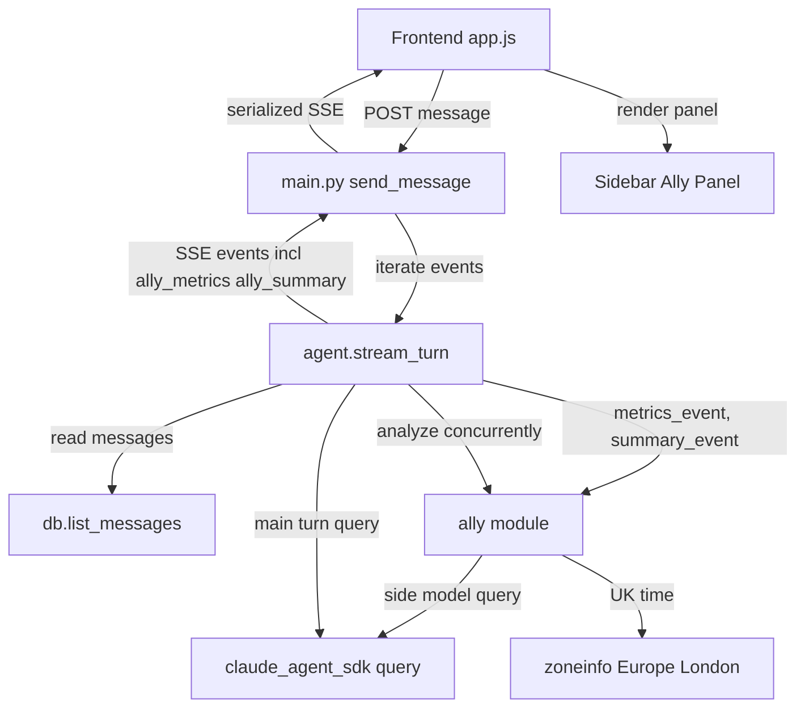
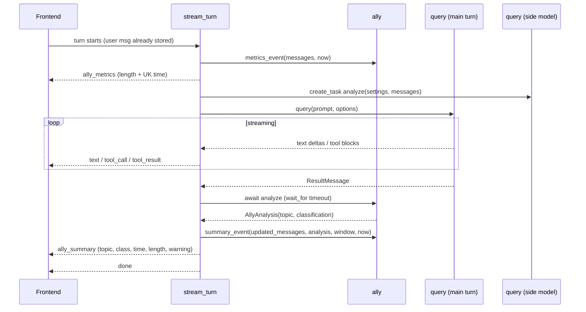

# Design Document

## Overview

**Purpose**: The Ally Panel gives the user an at-a-glance, *ally-framed* read on the current conversation — a short topic summary, a category, the current UK time, and conversation-length metrics — and turns red with a warning sign when the user is doing programming or scientific work late at night. The intent is gentle self-awareness, not impartial reporting.

**Users**: A single operator using the self-hosted chat app. The panel lives in the sidebar and updates as they interact.

**Impact**: Adds a new backend domain module (`app/ally.py`) and two new SSE event kinds that ride the existing turn stream. The assistant's actual replies and the persistence model are unchanged; `app/main.py` is not modified. Metrics update on user send; topic/classification/colour refresh on assistant turn completion, computed concurrently so the streamed reply is never delayed.

### Goals
- Render an ephemeral sidebar panel with topic, classification, UK time, and length metrics (R1, R2, R3, R4, R5).
- Generate topic + classification concurrently via a small side model without blocking the streamed reply (R2.2, R8.3).
- Apply red/warning colour only when inside a configurable late window AND the class is Programming-adjacent or Scientific (R6, R7).
- Update length on send and refresh everything on done (R8).

### Non-Goals
- Wellbeing extensions (eating/walking reminders, dependence-awareness questions) — separate future spec.
- Persisting panel state across reloads or a GUI for editing the late window.
- Changing assistant behaviour, the message schema, or `app/main.py` routing.
- Incorporating the in-progress assistant reply into the topic (one-turn lag is accepted; see Boundary).

## Boundary Commitments

### This Spec Owns
- The `app/ally.py` domain module: conversation metrics, UK-time computation, late-window parsing/evaluation, and the side-model conversation analysis (topic + classification).
- Two new SSE event types (`ally_metrics`, `ally_summary`) and their emission points inside `stream_turn`.
- The sidebar panel UI: markup, rendering of the four fields, and neutral/red(warning) presentation.
- Two new configuration values (`ALLY_LATE_WINDOW`, `ALLY_SUMMARY_MODEL`) read by `Settings`.

### Out of Boundary
- The conversation turn execution, tool handling, and message persistence in `stream_turn`/`db` (consumed read-only for metrics/transcript; not redefined).
- `app/main.py` routing, auth, and lock handling (unchanged).
- The message DB schema (no new columns/tables — panel state is ephemeral).

### Allowed Dependencies
- `app/ally.py` may depend on: `app/config.py` (Settings types), `app/db.py` (`MessageRow`, `list_messages` output shape), `app/events.py` (event dataclasses), `claude_agent_sdk.query`, and stdlib `zoneinfo`/`datetime`.
- `app/agent.py` may depend on `app/ally.py` and `app/events.py`.
- Dependency direction (strict, no upward imports): `events` / `config` / `db` → `ally` → `agent` → `main`.

### Revalidation Triggers
- Any change to the `ally_metrics` / `ally_summary` event shapes (frontend consumer must re-check).
- Any change to message `kind` values or `content_json` shape (metrics/transcript parsing depends on them).
- Adding the in-progress assistant reply to the analysis input (changes concurrency contract).
- Renaming/removing `ALLY_LATE_WINDOW` or `ALLY_SUMMARY_MODEL`.

## Architecture

### Existing Architecture Analysis
- `stream_turn` (in `app/agent.py`) drives one turn: it calls `query()`, yields typed events (`TextEvent`, `ToolCallEvent`, `ToolResultEvent`, `DoneEvent`, `ErrorEvent`), and persists rows via `app/db.py`. `DoneEvent` is the terminal event; the frontend uses it to finalize and reload the session list.
- `app/main.py::_send_message` appends the user message to the DB, then streams `serialize(event)` for each event `stream_turn` yields. `serialize()` is generic over the union.
- The frontend (`frontend/app.js`) consumes SSE blocks in `streamTurn`, switching on `event.type`.
- This design extends the event stream and adds a parallel computation; it preserves all existing patterns (typed frozen-dataclass events, DB-backed turn, generic serialize, type switch on the client).

### Architecture Pattern & Boundary Map



**Architecture Integration**:
- Selected pattern: additive domain service (`ally`) + event extension on the existing stream. Rationale: smallest change that satisfies all requirements while keeping `main.py` untouched.
- Boundaries: `ally` owns analysis/metrics/time/window as pure-ish functions; `agent` owns orchestration (when to call, what to yield); frontend owns presentation.
- Existing patterns preserved: frozen-dataclass SSE events + generic `serialize`; `query()` as the single model path; DB read via `list_messages`.
- New components rationale: `ally.py` isolates all new logic for unit-testing; two events because send-time and done-time payloads differ.

### Technology Stack

| Layer | Choice / Version | Role in Feature | Notes |
|-------|------------------|-----------------|-------|
| Frontend / CLI | Vanilla JS (existing) | Render sidebar panel; handle two new SSE event kinds | No new deps |
| Backend / Services | Python 3.11, `app/ally.py` (new) | Metrics, UK time, late-window, side-model analysis | Pure functions + one async analyze |
| Model | `claude-agent-sdk` `query()` (>=0.1.80, existing) | One-shot side-model call (Haiku) for topic+class | Default model `claude-haiku-4-5-20251001` |
| Data / Storage | SQLite via `app/db.py` (existing) | Read messages for metrics/transcript | Read-only; no schema change |
| Infrastructure / Runtime | `zoneinfo` (stdlib) | Europe/London BST/GMT time | No `tzdata` dep on Linux |

## File Structure Plan

### New Files
```
app/
└── ally.py        # Ally domain: types (AllyMetrics, AllyAnalysis, LateWindow),
                   # compute_metrics(), current_uk_time(), parse_late_window(),
                   # is_in_window()/evaluate_warning(), analyze() [async side-model],
                   # metrics_event()/summary_event() builders.
```

### Modified Files
- `app/events.py` — add `AllyMetricsEvent` and `AllySummaryEvent` frozen dataclasses; extend the `SSEEvent` union. (`serialize()` needs no change — neither event has `message_ord`, so no `id:` line.)
- `app/config.py` — add `ally_late_window: str` (default `"21:30-05:00"`) and `ally_summary_model: str` (default `claude-haiku-4-5-20251001`) to `Settings`; read `ALLY_LATE_WINDOW` / `ALLY_SUMMARY_MODEL` in `load_settings()`.
- `app/agent.py` — in `stream_turn`: read messages, yield `ally.metrics_event(...)` first; launch `asyncio.create_task(ally.analyze(...))`; on `ResultMessage`, await analysis (timeout-guarded), recompute metrics over the updated history, yield `ally.summary_event(...)`, then `DoneEvent`; cancel the analysis task on the error/early-exit paths.
- `frontend/index.html` — add the panel markup inside `<aside class="sidebar">` (e.g. an `#ally-panel` block with topic, class, time, length, and warning-sign elements).
- `frontend/app.js` — handle `ally_metrics` and `ally_summary` in `streamTurn`; render/update `#ally-panel`; reset to neutral empty state in `selectSession` and the new-chat handler.
- `frontend/styles.css` — `#ally-panel` layout and the `.warning` (red + warning sign) / neutral states.

> `app/main.py` is intentionally **not** modified — it serializes whatever events `stream_turn` yields.

## System Flows



Key decisions: the side-model task is launched before the main loop and awaited only at `ResultMessage`, so text deltas stream unblocked (R2.2, R8.3). On analyze timeout/failure, `summary_event` is built with a placeholder topic and `Other` class so `ally_summary` and `done` are always emitted (R2.3, R3.3). Metrics in `ally_summary` are recomputed over history that now includes the assistant reply (R8.2).

## Requirements Traceability

| Requirement | Summary | Components | Interfaces | Flows |
|-------------|---------|------------|------------|-------|
| 1.1, 1.2 | Sidebar panel with 4 fields | Panel UI, both events | `#ally-panel`, `ally_metrics`/`ally_summary` | render panel |
| 1.3 | Ally framing / neutral default | Panel UI, styles | `.warning` vs neutral | render |
| 1.4, 1.5 | Ephemeral, empty on open/reload | `app.js` reset logic | `selectSession`, new-chat handler | n/a |
| 2.1 | Topic phrase on turn done | `ally.analyze`, `summary_event` | `AllyAnalysis.topic` | side model |
| 2.2 | Concurrent, non-blocking | `stream_turn` task launch | `asyncio.create_task` | sequence |
| 2.3 | Topic failure → placeholder | `ally.analyze` fallback | `AllyAnalysis` | side model |
| 3.1, 3.2 | Classify into the 4-set; display | `ally.analyze`, Panel UI | `AllyAnalysis.classification` | side model |
| 3.3 | Class failure → Other | `ally.analyze` fallback | `AllyAnalysis` | side model |
| 4.1, 4.2 | UK time, BST/GMT, server-side | `ally.current_uk_time` | `zoneinfo` | metrics/summary |
| 5.1 | Length format string | `compute_metrics`, Panel UI | format `{A}/{U}W (A/U), {M}M` | render |
| 5.2 | Word counts A/U | `compute_metrics` | `AllyMetrics` | metrics |
| 5.3 | Message count M | `compute_metrics` | `AllyMetrics` | metrics |
| 5.4 | Exclude tool entries from counts | `compute_metrics` | `AllyMetrics` | metrics |
| 5.5 | Length updates on send | `metrics_event` (first yield) | `ally_metrics` | sequence |
| 6.1 | Red+warning when late & unhelpful | `evaluate_warning` | `AllySummaryEvent.warning` | summary |
| 6.2, 6.3, 6.4 | Neutral otherwise / class & time gating | `evaluate_warning` | `AllySummaryEvent.warning` | summary |
| 7.1 | Single config value for window | `Settings`, `parse_late_window` | `ALLY_LATE_WINDOW` | n/a |
| 7.2 | Unset/invalid → default 21:30-05:00 | `parse_late_window` fallback | `LateWindow` | n/a |
| 7.3 | Window spans midnight | `is_in_window` | `LateWindow` | summary |
| 8.1 | Update length on send | `metrics_event` | `ally_metrics` | sequence |
| 8.2 | Refresh all on done | `summary_event` | `ally_summary` | sequence |
| 8.3 | Never block stream | `stream_turn` task | `asyncio` | sequence |

## Components and Interfaces

| Component | Domain/Layer | Intent | Req Coverage | Key Dependencies (P0/P1) | Contracts |
|-----------|--------------|--------|--------------|--------------------------|-----------|
| `ally` module | Service | Metrics, time, window, side-model analysis, event builders | 2,3,4,5,6,7 | db rows (P0), events (P0), query (P0), config (P1) | Service, State |
| `AllyMetricsEvent` / `AllySummaryEvent` | Types/Event | Carry panel payloads over SSE | 1,5,6,8 | events union (P0) | Event |
| `Settings` (ext.) | Config | Expose window + side-model id | 7 | env (P1) | State |
| `stream_turn` (ext.) | Runtime | Orchestrate emission + concurrency | 2.2,8 | ally (P0), query (P0) | Service |
| Ally Panel UI | UI | Render four fields + warning state | 1,3,4,5,6 | events (P0) | — |

### Service — `app/ally.py`

| Field | Detail |
|-------|--------|
| Intent | All new Ally logic: pure computation + one async side-model call + event builders |
| Requirements | 2.1, 2.2, 2.3, 3.1, 3.3, 4.1, 4.2, 5.1, 5.2, 5.3, 5.4, 6.1, 6.2, 6.3, 6.4, 7.1, 7.2, 7.3 |

**Responsibilities & Constraints**
- Owns metric computation, UK-time, late-window parsing/evaluation, conversation analysis, and event construction.
- Pure functions accept an optional injected `now: datetime | None` for deterministic tests; `analyze` is the only async/IO function.
- Does not write to the DB and does not import `agent`/`main` (dependency direction).

**Dependencies**
- Inbound: `app/agent.py::stream_turn` — calls all builders (P0).
- Outbound: `app/events.py` — constructs event dataclasses (P0); `app/db.py` `MessageRow` shape — reads `role`/`kind`/`content_json` (P0); `app/config.py` `Settings` — model id + raw window (P1).
- External: `claude_agent_sdk.query` — side-model call (P0); `zoneinfo` — timezone (P0).

**Contracts**: Service [x] / API [ ] / Event [ ] / Batch [ ] / State [x]

##### Service Interface
```python
ALLOWED_CLASSES = ("Programming-adjacent", "Philosophical", "Scientific", "Other")
WARNING_CLASSES = frozenset({"Programming-adjacent", "Scientific"})
DEFAULT_LATE_WINDOW = "21:30-05:00"
TOPIC_PLACEHOLDER = "—"  # neutral placeholder when analysis unavailable

@dataclass(frozen=True)
class AllyMetrics:
    agent_words: int
    user_words: int
    message_count: int

@dataclass(frozen=True)
class AllyAnalysis:
    topic: str           # short phrase; TOPIC_PLACEHOLDER on failure
    classification: str  # one of ALLOWED_CLASSES; "Other" on failure/unknown

@dataclass(frozen=True)
class LateWindow:
    start: time          # UK local
    end: time            # UK local

def compute_metrics(messages: list[MessageRow]) -> AllyMetrics: ...
def current_uk_time(now: datetime | None = None) -> str: ...        # "HH:MM"
def parse_late_window(raw: str) -> LateWindow: ...                  # invalid -> DEFAULT
def is_in_window(window: LateWindow, now: datetime | None = None) -> bool: ...  # midnight-aware
def evaluate_warning(classification: str, window: LateWindow,
                     now: datetime | None = None) -> bool: ...

async def analyze(settings: Settings, messages: list[MessageRow]) -> AllyAnalysis: ...

def metrics_event(messages: list[MessageRow],
                  now: datetime | None = None) -> AllyMetricsEvent: ...
def summary_event(messages: list[MessageRow], analysis: AllyAnalysis,
                  window: LateWindow, now: datetime | None = None) -> AllySummaryEvent: ...
```
- **Preconditions**: `messages` are this session's rows in `ord` order (as returned by `db.list_messages`).
- **Postconditions**: `compute_metrics` counts words only over `kind == "text"` user/assistant rows; `message_count` = number of those text rows (tool_call/tool_result/error excluded — R5.4, and `M` per research decision). `evaluate_warning` returns `True` iff `classification in WARNING_CLASSES and is_in_window(...)`.
- **Invariants**: `analyze` never raises to the caller — failures (exception, timeout handled by caller, malformed/empty JSON, unknown class) collapse to `AllyAnalysis(TOPIC_PLACEHOLDER, "Other")`.

##### `analyze` behavior
- Builds a compact transcript from the **last N** `text` messages (cap, e.g. 20, to bound cost) and calls `query(prompt=<transcript+instruction>, options=ClaudeAgentOptions(model=settings.ally_summary_model))` with no tools/no resume.
- Instruction asks for strict JSON `{"topic": "<short phrase>", "classification": "<one of the 4>"}`. Response text is collected from `AssistantMessage`/`TextBlock`s, JSON-parsed defensively; `classification` is validated against `ALLOWED_CLASSES` (unknown → `Other`).

##### State Management
- No persistence. All values are derived per call; panel state is ephemeral (R1.4).

**Implementation Notes**
- Integration: `stream_turn` owns the timeout (`asyncio.wait_for(analyze_task, …)`) and task cancellation; `analyze` itself does not sleep/timeout.
- Validation: enforce `classification ∈ ALLOWED_CLASSES`; clamp/trim topic length.
- Risks: side-model cost on long chats (mitigated by transcript cap); see `research.md` Risks.

### Types — `app/events.py` additions

**Contracts**: Event [x]

```python
@dataclass(frozen=True)
class AllyMetricsEvent:
    agent_words: int
    user_words: int
    message_count: int
    uk_time: str
    kind: Literal["ally_metrics"] = "ally_metrics"

@dataclass(frozen=True)
class AllySummaryEvent:
    topic: str
    classification: str
    agent_words: int
    user_words: int
    message_count: int
    uk_time: str
    warning: bool
    kind: Literal["ally_summary"] = "ally_summary"

SSEEvent = Union[TextEvent, ToolCallEvent, ToolResultEvent,
                 DoneEvent, ErrorEvent, AllyMetricsEvent, AllySummaryEvent]
```
- **Event Contract**: `ally_metrics` published as the first event of a turn (after the user message is stored). `ally_summary` published immediately before `done`. No ordering guarantees relative to text deltas other than: `ally_metrics` first, `ally_summary` then `done` last. No `id:` line (no `message_ord`) — `serialize()` already handles this.

### Config — `app/config.py` additions
- `Settings.ally_late_window: str` (raw `ALLY_LATE_WINDOW`, default `"21:30-05:00"`).
- `Settings.ally_summary_model: str` (raw `ALLY_SUMMARY_MODEL`, default `"claude-haiku-4-5-20251001"`).
- `load_settings()` reads/strips both with the documented defaults; parsing/validation of the window is deferred to `ally.parse_late_window` (R7.2).

### UI — Ally Panel (`frontend`)
- **Markup** (`index.html`): `#ally-panel` inside `.sidebar`, with child nodes for topic, classification, UK time, length string, and a hidden warning-sign element.
- **Behavior** (`app.js`): on `ally_metrics` → update length + time (leave topic/class as-is or neutral); on `ally_summary` → set topic, class, time, length, and toggle `#ally-panel.warning` from `data.warning`; on `selectSession` / new-chat → reset to neutral empty state (R1.5).
- **Styles** (`styles.css`): neutral/positive default; `.warning` applies red treatment and reveals the warning sign (R6.1).

**Implementation Note**: presentational only — no new client contracts beyond consuming the two events.

## Error Handling

### Error Strategy
Graceful degradation everywhere the panel is concerned: the panel must never break the chat turn.

### Error Categories and Responses
- **Side-model failure / timeout / malformed JSON** (analysis): collapse to `AllyAnalysis(TOPIC_PLACEHOLDER, "Other")`; `ally_summary` and `done` still emit (R2.3, R3.3). `stream_turn` cancels the analysis task on the existing exception path so no orphan task survives a failed turn.
- **Invalid `ALLY_LATE_WINDOW`**: `parse_late_window` falls back to `21:30-05:00` (R7.2); startup is not failed for this.
- **Unknown classification value**: coerced to `Other` before display/warning evaluation.
- **Frontend missing fields**: render defensively (empty string / neutral) rather than throwing in the SSE loop.

### Monitoring
- Reuse module logging; log (at warning level) side-model failures and window parse fallbacks. No new metrics infra.

## Testing Strategy

### Unit Tests (`tests/test_ally.py`, new)
- `compute_metrics`: counts agent vs user words and `M` over text rows; excludes tool_call/tool_result/error rows (R5.1–5.4).
- `current_uk_time`: returns Europe/London `HH:MM` for a known UTC instant in BST and in GMT (R4.1, R4.2).
- `parse_late_window`: valid `"22:00-04:30"`; invalid string → default; empty → default (R7.1, R7.2).
- `is_in_window` / `evaluate_warning`: midnight-crossing window membership; warning true only for Programming-adjacent/Scientific inside window, false for Philosophical/Other or outside window (R6.1–6.4, R7.3).
- `analyze` (mock `query`): valid JSON → topic+class; malformed/empty/unknown-class → `(placeholder, "Other")` (R2.1, 2.3, 3.1, 3.3).

### Integration Tests (`tests/test_agent.py`, extend; mock `query` + inject `now`)
- First yielded event is `AllyMetricsEvent` carrying the post-send length and UK time (R5.5, R8.1).
- `AllySummaryEvent` is yielded immediately before `DoneEvent`, with topic/class/length/time and correct `warning` (R8.2).
- Analysis failure/timeout still yields `ally_summary` (placeholder/Other) then `done`; no orphaned task (R2.3, R8.3).
- Text deltas are emitted before `ally_summary`, demonstrating non-blocking concurrency (R2.2, R8.3).

### E2E/UI Tests (`tests_e2e/`, extend the SPA stub)
- After a stubbed turn, `#ally-panel` shows all four fields in the sidebar (R1.1, R1.2).
- Stubbed `ally_summary` with `warning: true` applies the red `.warning` state and reveals the warning sign (R6.1).
- New chat / fresh load shows the neutral empty state (R1.4, R1.5).

## Performance & Scalability
- Side-model call runs concurrently with the main turn and is bounded by a caller-side timeout, so it adds no latency to streamed text and a bounded worst-case delay to `done` (R2.2, R8.3).
- Transcript handed to the side model is capped (last N text messages) to bound token cost on long conversations.
