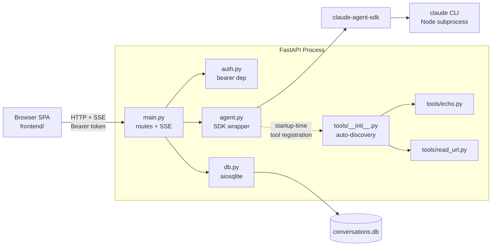
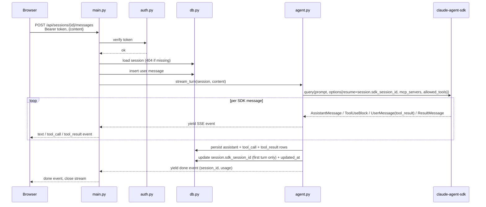
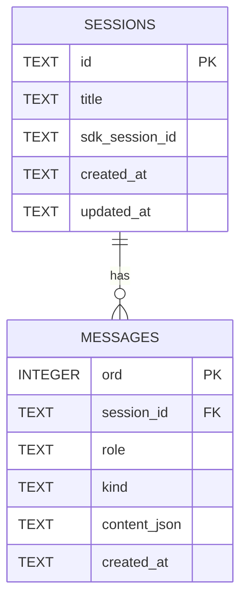

# Design Document

## Overview

**Purpose**: This feature delivers a private, self-hosted browser surface for chatting with a Claude agent powered by the official `claude-agent-sdk` Python package, with first-class support for the operator dropping in custom Python tools.

**Users**: A single operator runs the app on their own machine or on a small managed host (Railway). They authenticate with a shared bearer token, chat with the agent, watch tool calls stream live, and resume past sessions.

**Impact**: Greenfield. No existing system to integrate with.

### Goals
- Stream Claude agent responses (text, tool calls, tool results, completion) to the browser over SSE with sub-second first-token latency on a warm CLI.
- Make adding a new tool a one-file change in `app/tools/` — no edits to routing, the agent loop, or the frontend.
- Persist conversations across restarts; resume any past session by id.
- Total runtime + frontend code small enough for a single reader to hold in their head (~1k LOC target, not a hard cap).

### Non-Goals
- Multi-user accounts, role-based access, SSO.
- External MCP server config (`mcp_servers.json`). The SDK's *internal* MCP mechanism is used for tool registration; the operator never sees it.
- Hot-reload of tools without process restart.
- Custom-domain setup or Cloudflare Access lock-down (deferred follow-up per R6).
- Markdown / syntax highlighting in the frontend (deferred; MVP renders plain text with `<pre>`-wrapped fenced code blocks).

## Boundary Commitments

### This Spec Owns
- The HTTP API surface: `GET /`, `POST /api/sessions`, `GET /api/sessions`, `GET /api/sessions/{id}/messages`, `POST /api/sessions/{id}/messages`.
- The SSE event vocabulary emitted on `POST /api/sessions/{id}/messages` (`text`, `tool_call`, `tool_result`, `done`, `error`).
- The SQLite schema for `sessions` and `messages`.
- The auto-discovery contract for `app/tools/` (which Python objects count as a tool, how they get registered).
- The bearer-token authentication policy for all `/api/*` endpoints.
- The browser SPA at `frontend/` and the static-mount that serves it.
- The `poe` task definitions in `pyproject.toml`.

### Out of Boundary
- Anthropic API behavior, model selection logic beyond exposing a single `ANTHROPIC_MODEL` env knob, and prompt engineering (lives inside the SDK / model).
- The Claude Code CLI lifecycle — the SDK manages subprocess spawning.
- Network ingress, TLS termination, and lock-down policy (Cloudflare Access, Tailscale Funnel, reverse proxy). The operator owns this.
- Markdown rendering, syntax highlighting, and rich content blocks in the frontend.
- External MCP server orchestration.

### Allowed Dependencies
- `claude-agent-sdk` (≥0.1.80) — agent loop, tool registration, session resume.
- `fastapi`, `uvicorn`, `sse-starlette` — HTTP + SSE.
- `aiosqlite` — async SQLite driver.
- `httpx` — used by the `read_url` example tool only.
- `python-dotenv` (dev only) — load `.env` for local runs.
- `poethepoet` (dev only) — task runner.
- The host must provide Node ≥18 and `@anthropic-ai/claude-code` on `PATH` (SDK prerequisite).

### Revalidation Triggers
- A `claude-agent-sdk` major version bump or change to the message/event types, `ClaudeAgentOptions` shape, or `@tool`/`create_sdk_mcp_server` API.
- Any change to the tool-discovery contract (e.g. supporting class-based tools, sync tools, or per-tool config files).
- Adding a second authentication mechanism (revisit `app/auth.py` and the frontend token prompt).
- Schema changes to `sessions` or `messages` (need a migration story).

## Architecture

### Architecture Pattern & Boundary Map



**Pattern**: thin layered service. `main.py` is the only place HTTP and SSE concerns live; `agent.py` is the only place the SDK is touched; `db.py` is the only place SQL is written. Layers import strictly leftward in the dependency direction below.

**Dependency direction** (strictly enforced): `tools/* → agent.py → main.py`, `db.py → main.py`, `auth.py → main.py`. `tools/*` does not import `agent.py` or `main.py`. `agent.py` does not import `main.py`.

### Technology Stack

| Layer | Choice / Version | Role in Feature | Notes |
|-------|------------------|-----------------|-------|
| Frontend | Vanilla HTML5 + ES module JS | Chat UI, SSE consumer | No build step, no third-party JS (R5 AC8) |
| Backend | Python 3.11+, FastAPI ≥0.110, uvicorn, sse-starlette | HTTP routes, SSE streaming | |
| Agent | `claude-agent-sdk` ≥0.1.80 | Agent loop, tool exec, session resume | Shells out to `claude` CLI |
| Storage | SQLite via `aiosqlite`, WAL mode | Sessions + messages | Path from `CONVERSATIONS_DB_PATH` |
| HTTP client | `httpx` | Used inside `read_url` tool | |
| Task runner | `poethepoet` | `poe dev`, `poe demo`, etc. | Dev-only |
| Type checker | `mypy` (strict) | Static type checking over `app/` via `poe types` | Tests excluded |
| Packaging | `pyproject.toml`, `uv` | Lockfile + run | |
| Deploy | Railway nixpacks | Auto-detect Python; declare Node via `nixpacks.toml` | |

## File Structure Plan

### Directory Structure
```
app/
├── __init__.py
├── main.py              # FastAPI app, route handlers, SSE streaming, static mount
├── auth.py              # Bearer-token dependency
├── agent.py             # claude-agent-sdk wrapper: build options, run turn, map events to SSE
├── db.py                # aiosqlite helpers: schema init, sessions CRUD, messages CRUD
├── config.py            # Read & validate env (APP_AUTH_TOKEN, ANTHROPIC_API_KEY, CONVERSATIONS_DB_PATH, ANTHROPIC_MODEL)
├── events.py            # SSE event dataclasses + serializer (text, tool_call, tool_result, done, error)
└── tools/
    ├── __init__.py      # Auto-discovery: scan modules, collect @tool-decorated funcs, build SDK MCP server
    ├── echo.py          # Example tool
    └── read_url.py      # Example tool

frontend/
├── index.html           # Shell: sidebar + main pane + composer
├── app.js               # ES module: token prompt, session list, message rendering, EventSource handling
└── styles.css           # Minimal flat CSS

tests/
├── test_db.py           # Schema + CRUD round-trip
├── test_auth.py         # 401 paths, valid token passthrough
├── test_tools_discovery.py  # echo + read_url discovered, broken module skipped
└── test_routes.py       # API contract: sessions create/list, messages history, SSE event smoke

.kiro/specs/claude-agent-webapp/   # spec docs (already exists)
.env.example
nixpacks.toml             # Declares python + nodejs, installs claude CLI
pyproject.toml            # Deps, [tool.poe.tasks]
README.md
conversations.db          # Runtime artifact (gitignored)
```

Each file has one clear responsibility. `events.py` is the only place the SSE wire format is defined — both `agent.py` (producer) and `main.py` (serializer) import from it. `config.py` is the only place env vars are read.

### Modified Files
- None — greenfield.

## System Flows

### Send-message turn (the only non-trivial flow)



Notes:
- The handler acquires the per-session lock (`app.state.session_locks[session_id]`) before calling `agent.stream_turn` and releases it on stream close. A second concurrent request for the same session id returns **409 Conflict**.
- Persistence happens **as events are yielded**, not only at the end, so the DB matches what the operator saw if the connection drops mid-stream (R3 AC6).
- Errors raised by the SDK or a tool are caught in `agent.py`, persisted as a failure marker on the assistant message, then emitted as an SSE `error` event before the stream closes (R3 AC7).
- Client disconnect mid-stream is detected via `await request.is_disconnected()`; the handler stops iterating, releases the lock, and exits without emitting `done`.

## Requirements Traceability

| Requirement | Summary | Components | Interfaces / Flows |
|-------------|---------|------------|--------------------|
| 1.1–1.6 | Bearer token auth, no key leak | `auth.py`, `config.py`, `main.py` | FastAPI `Depends(require_token)` |
| 2.1–2.6 | Session lifecycle + SQLite + resume | `db.py`, `main.py`, `agent.py` | API contract below; SDK `resume=` |
| 3.1–3.7 | SSE streaming + persistence | `agent.py`, `events.py`, `main.py` | Send-message flow above |
| 4.1–4.6 | Tool auto-discovery + examples | `tools/__init__.py`, `tools/echo.py`, `tools/read_url.py` | `discover_tools()` + SDK MCP server |
| 5.1–5.8 | Browser chat UI | `frontend/index.html`, `frontend/app.js`, `frontend/styles.css` | Static mount |
| 6.1–6.7 | Config, deploy, ops | `config.py`, `pyproject.toml`, `nixpacks.toml`, `Procfile`, README | |
| 7.1–7.7 | `poe` tasks | `pyproject.toml` `[tool.poe.tasks]` | |

## Components and Interfaces

| Component | Domain/Layer | Intent | Req Coverage | Key Dependencies | Contracts |
|-----------|--------------|--------|--------------|------------------|-----------|
| `config.py` | Bootstrap | Load + validate env vars | 1.1, 1.2, 6.1, 6.2 | stdlib | State |
| `auth.py` | Edge | Bearer-token FastAPI dependency | 1.3 | `config.py` | Service |
| `db.py` | Persistence | aiosqlite helpers | 2.x, 3.6 | `aiosqlite` | Service, State |
| `events.py` | Shared | SSE event types + serialization | 3.x | — | Event |
| `agent.py` | Domain | Wrap SDK, produce events, persist | 2.6, 3.x, 4.4 | `claude-agent-sdk`, `db.py`, `events.py`, `tools/` | Service, Event |
| `tools/__init__.py` | Domain | Auto-discover, build SDK MCP server | 4.1, 4.5 | `claude-agent-sdk` | Service |
| `tools/echo.py` | Domain | Example tool | 4.2 | — | (SDK tool) |
| `tools/read_url.py` | Domain | Example tool | 4.3 | `httpx` | (SDK tool) |
| `main.py` | Edge | FastAPI routes + SSE | 1.4–1.6, 2.x, 3.x, 5.1 | all of the above | API |
| `frontend/*` | UI | SPA | 5.x | native browser | (HTTP) |

### Bootstrap & Edge

#### `config.py`

| Field | Detail |
|-------|--------|
| Intent | Single source of truth for env vars; validate at startup |
| Requirements | 1.1, 1.2, 6.1, 6.2 |

**Service Interface** (Python):
```python
@dataclass(frozen=True)
class Settings:
    app_auth_token: str          # APP_AUTH_TOKEN, required, non-empty
    anthropic_api_key: str       # ANTHROPIC_API_KEY, required, non-empty
    conversations_db_path: Path  # CONVERSATIONS_DB_PATH, default ./conversations.db
    anthropic_model: str | None  # ANTHROPIC_MODEL, optional (None → SDK default)

def load_settings() -> Settings: ...
```
- **Preconditions**: env vars present and non-empty for the required fields.
- **Postconditions**: returns frozen `Settings` or raises `RuntimeError` with a message naming the missing var.
- **Invariants**: function is pure (only reads env); called exactly once at startup, result stashed on `app.state.settings`.

#### `auth.py`

| Field | Detail |
|-------|--------|
| Intent | FastAPI dependency that rejects requests without a matching bearer token |
| Requirements | 1.3 |

**Service Interface**:
```python
async def require_token(request: Request) -> None: ...  # raises HTTPException(401) on mismatch
```
- Compares using `secrets.compare_digest` against `request.app.state.settings.app_auth_token`.
- Mounted on every `/api/*` route via `dependencies=[Depends(require_token)]` on the router.
- The static mount at `/` is **not** gated (the SPA shell loads, then the SPA prompts for the token before any API call). R1 AC4–AC5 cover frontend behavior.

### Persistence

#### `db.py`

| Field | Detail |
|-------|--------|
| Intent | aiosqlite helpers for schema init, session CRUD, message append/list |
| Requirements | 2.1–2.6, 3.6 |

**Service Interface**:
```python
async def init_db(path: Path) -> None: ...                # CREATE TABLE IF NOT EXISTS, PRAGMA WAL

async def create_session(path: Path, *, title: str | None = None) -> SessionRow: ...
async def list_sessions(path: Path) -> list[SessionRow]: ...
async def get_session(path: Path, session_id: str) -> SessionRow | None: ...
async def update_session_sdk_id(path: Path, session_id: str, sdk_session_id: str) -> None: ...
async def touch_session(path: Path, session_id: str) -> None: ...   # bump updated_at

async def append_message(
    path: Path,
    *,
    session_id: str,
    role: Literal["user", "assistant"],
    kind: Literal["text", "tool_call", "tool_result", "error"],
    content_json: str,
) -> MessageRow: ...
async def list_messages(path: Path, session_id: str) -> list[MessageRow]: ...
```
- **Preconditions**: `init_db` invoked at startup before any other call.
- **Postconditions**: writes are durable on commit; lists return rows ordered by `(session_id, ord ASC)` for messages, `updated_at DESC` for sessions.
- **Invariants**: each call opens its own short-lived connection; no long-lived connection pool.

### Domain

#### `agent.py`

| Field | Detail |
|-------|--------|
| Intent | Run a single turn against the SDK, translate the message stream into SSE events, persist as it goes |
| Requirements | 2.6, 3.1–3.7, 4.4 |

**Service Interface**:
```python
async def stream_turn(
    settings: Settings,
    db_path: Path,
    session: SessionRow,
    user_content: str,
) -> AsyncIterator[SSEEvent]: ...
```
- Builds `ClaudeAgentOptions(resume=session.sdk_session_id or None, mcp_servers={"local": tools.MCP_SERVER}, allowed_tools=tools.ALLOWED_TOOLS, model=settings.anthropic_model)`.
- Iterates `query(prompt=user_content, options=...)`. For each message:
  - `AssistantMessage` → for each `TextBlock` yield a `text` event and append a `kind="text"` row; for each `ToolUseBlock` yield a `tool_call` event and append `kind="tool_call"`.
  - `UserMessage` whose content includes a tool-result block → yield `tool_result` and append `kind="tool_result"`.
  - `ResultMessage` → if first turn, persist `session.sdk_session_id`; touch `updated_at`; yield terminal `done` event with `session_id`, `total_cost_usd`, `usage.is_error`.
- On any exception during iteration → append `kind="error"` row, yield `error` event, then exit. Caller closes the SSE stream.
- **Token deltas**: MVP does **not** set `include_partial_messages=True`; one `text` event per `TextBlock`. Trade-off recorded in research.md; revisit if perceived latency is poor.

#### `tools/__init__.py`

| Field | Detail |
|-------|--------|
| Intent | Discover and register every tool in the package as one in-process SDK MCP server |
| Requirements | 4.1, 4.5 |

**Service Interface**:
```python
MCP_SERVER: McpSdkServerConfig    # built at import time
ALLOWED_TOOLS: list[str]          # e.g. ["mcp__local__echo", "mcp__local__read_url"]

def _discover() -> list[object]: ...   # private; iterates package __path__
```

**Tool module contract** (owned by this spec, not by the SDK):
- Every module under `app/tools/` MUST export a module-level `TOOLS: list` whose entries are the tool objects produced by the SDK's `@tool` decorator. Modules without a `TOOLS` attribute are ignored (treated as helpers).
- Discovery walks `app.tools.__path__` with `pkgutil.iter_modules`, imports each submodule under a try/except, then concatenates every module's `TOOLS` list. Tools without an SDK `@tool` decorator are filtered out at registration time (the SDK rejects them).
- A module that fails to import OR whose `TOOLS` attribute is malformed is logged with `logger.error(...)` and skipped — startup continues with the remaining valid tools (R4 AC5).
- `MCP_SERVER` is built once at module load via `create_sdk_mcp_server(name="local", version="0.1.0", tools=tool_list)` and reused on every turn.

This contract is owned by **us**, not the SDK. We never inspect SDK-internal markers, so an SDK minor-version bump that renames internals does not break discovery. The "how to add a tool" example in the README adds exactly one line (`TOOLS = [my_tool]`) on top of the `@tool` decorator.

#### `tools/echo.py`
```python
from claude_agent_sdk import tool

@tool("echo", "Return the input string unchanged.", {"text": str})
async def echo(args):
    return {"content": [{"type": "text", "text": args["text"]}]}

TOOLS = [echo]
```

#### `tools/read_url.py`
```python
import httpx
from claude_agent_sdk import tool

@tool("read_url", "Fetch a URL and return its body as text.", {"url": str})
async def read_url(args):
    async with httpx.AsyncClient(timeout=10.0, follow_redirects=True) as client:
        r = await client.get(args["url"])
        r.raise_for_status()
        body = r.text[:200_000]   # cap to keep responses sane
    return {"content": [{"type": "text", "text": body}]}

TOOLS = [read_url]
```

### Edge

#### `main.py`

**API Contract**:

| Method | Endpoint | Auth | Request | Response | Errors |
|--------|----------|------|---------|----------|--------|
| GET | `/` | none | — | `index.html` | — |
| GET | `/static/*` | none | — | static files | 404 |
| POST | `/api/sessions` | bearer | `{ "title"?: string }` | `{ "id": string, "title": string \| null, "created_at": iso8601, "updated_at": iso8601 }` | 401 |
| GET | `/api/sessions` | bearer | — | `{ "sessions": SessionRow[] }`, sorted by `updated_at DESC` | 401 |
| GET | `/api/sessions/{id}/messages` | bearer | — | `{ "messages": MessageRow[] }`, in `ord ASC` | 401, 404 |
| POST | `/api/sessions/{id}/messages` | bearer | `{ "content": string }` | SSE stream (see events) | 401, 404, 409 (session_busy), 422 |

**SSE wire framing** (pinned contract — server and frontend parser MUST match):
- `Content-Type: text/event-stream; charset=utf-8`
- `Cache-Control: no-cache`, `X-Accel-Buffering: no` (defeats reverse-proxy buffering)
- Each event is exactly `event: <type>\ndata: <json>\n\n`. UTF-8. JSON `data` is a single line (no embedded `\n`); inner newlines in `text` are JSON-escaped as `\n`.
- No `id:`, no `retry:`, no `:`-prefixed comment lines. The hand-rolled fetch+ReadableStream parser on the frontend assumes this exact framing and splits on `\n\n`.
- The terminal `done` event is always emitted last on a successful turn; on an error path, a single `error` event is emitted, then the stream closes without `done`.

**SSE event vocabulary** (defined in `events.py`):

| `event:` | `data:` JSON |
|----------|--------------|
| `text` | `{ "text": string, "message_ord": int }` |
| `tool_call` | `{ "id": string, "name": string, "input": object, "message_ord": int }` |
| `tool_result` | `{ "tool_use_id": string, "output": string, "is_error": boolean, "message_ord": int }` |
| `done` | `{ "session_id": string, "usage": object, "is_error": boolean }` |
| `error` | `{ "message": string }` |

**Concurrency**: each session has a per-session `asyncio.Lock` held in `app.state.session_locks: dict[str, asyncio.Lock]` (lazily created). `POST /api/sessions/{id}/messages` acquires the lock for the duration of the turn. A second request for the same session arriving before the first completes returns **HTTP 409 Conflict** with `{"error": "session_busy"}` rather than queuing — keeps semantics obvious and prevents the user-facing impression of a hung browser. This guarantees the "first turn captures `sdk_session_id`, subsequent turns use `resume=`" sequence cannot race (R2 AC6).

**Client disconnect mid-stream**: the request handler periodically checks `await request.is_disconnected()` between SSE events. If the client has closed the connection: stop iterating the SDK stream, persist any rows that were already streamed (they are written as events are yielded, so this is automatic), do **not** write a `done` row, release the session lock, and exit cleanly. The session is left in a state where the next turn's `resume=sdk_session_id` will pick up wherever the SDK got to — which may be slightly past what the operator saw if the SDK had buffered more output. This is acceptable per R3 AC6 ("history reflects what the operator saw") since the persisted rows still match what was streamed.

### UI

#### `frontend/app.js`
- On load: read token from in-memory state; if absent, show modal and store on submit.
- Sidebar: `GET /api/sessions` on load + after each new chat; click row → `GET /api/sessions/{id}/messages` and render history.
- Composer: on submit, append user bubble locally, open `EventSource` (token in `Authorization` header via fetch + reader, since `EventSource` doesn't support custom headers — implementation note: use `fetch` + `ReadableStream` SSE parser, not `EventSource`). Append text deltas to the in-progress assistant bubble; render `tool_call`/`tool_result` as `<details>` collapsibles; close on `done`.
- Implementation note: native `EventSource` cannot send `Authorization` headers; use `fetch` + a ~30-line `ReadableStream`-based SSE parser to honor R1 AC3 (auth on every API call).

## Data Models

### Logical Data Model



### Physical Data Model (SQLite)

```sql
CREATE TABLE IF NOT EXISTS sessions (
    id              TEXT PRIMARY KEY,           -- uuid4 hex string
    title           TEXT,
    sdk_session_id  TEXT,                       -- captured from first ResultMessage; nullable until then
    created_at      TEXT NOT NULL,              -- ISO8601 UTC
    updated_at      TEXT NOT NULL
);

CREATE TABLE IF NOT EXISTS messages (
    ord             INTEGER PRIMARY KEY AUTOINCREMENT,  -- monotonic ordering
    session_id      TEXT NOT NULL REFERENCES sessions(id) ON DELETE CASCADE,
    role            TEXT NOT NULL CHECK (role IN ('user','assistant')),
    kind            TEXT NOT NULL CHECK (kind IN ('text','tool_call','tool_result','error')),
    content_json    TEXT NOT NULL,              -- shape depends on kind
    created_at      TEXT NOT NULL
);

CREATE INDEX IF NOT EXISTS idx_messages_session ON messages(session_id, ord);
CREATE INDEX IF NOT EXISTS idx_sessions_updated ON sessions(updated_at DESC);

PRAGMA journal_mode = WAL;
PRAGMA foreign_keys = ON;
```

**`content_json` shape per `kind`**:
- `text` → `{ "text": string }`
- `tool_call` → `{ "id": string, "name": string, "input": object }`
- `tool_result` → `{ "tool_use_id": string, "output": string, "is_error": boolean }`
- `error` → `{ "message": string }`

## Error Handling

### Error Strategy
- **Startup**: missing `APP_AUTH_TOKEN` or `ANTHROPIC_API_KEY` → raise `RuntimeError`, uvicorn exits non-zero (R1 AC2, R6 AC2).
- **Auth**: missing/mismatched token → `HTTPException(401)` with `WWW-Authenticate: Bearer` (R1 AC3).
- **Not found**: unknown session id on history fetch or send-message → `HTTPException(404)` (R2 AC4).
- **Validation**: malformed JSON body → FastAPI's default 422.
- **Mid-stream agent / tool error**: caught in `agent.py`, persisted as a `kind="error"` message row, emitted as an SSE `error` event, stream closed cleanly (R3 AC7).
- **Tool import failure at startup**: logged, skipped, app continues (R4 AC5).
- **Tool execution failure**: surfaces as a `tool_result` with `is_error: true` (the SDK already maps tool exceptions this way). Does not abort the turn.

### Monitoring
- Standard Python `logging` to stderr, default `INFO`.
- No external metrics/telemetry per R5 AC8 (frontend) and the prototype constraint (server).

## Testing Strategy

### Unit Tests
- `test_db.py`: schema init is idempotent; `create_session` → `get_session` → `list_messages` round-trip; `update_session_sdk_id` persists; sessions ordered by `updated_at DESC` after `touch_session`.
- `test_auth.py`: missing header → 401; wrong token → 401; correct token → handler runs; constant-time compare path used (smoke).
- `test_tools_discovery.py`: `MCP_SERVER` includes `echo` and `read_url`; a deliberately broken module placed in `tests/fixtures/broken_tool.py` is skipped with a logged error.
- `test_events.py`: SSE serializer round-trips each event variant.

### Integration Tests
- `test_routes.py` (using `httpx.AsyncClient` against the FastAPI app):
  - `POST /api/sessions` → returns id, then `GET /api/sessions` lists it.
  - `GET /api/sessions/{id}/messages` returns 404 for unknown id.
  - `POST /api/sessions/{id}/messages` with the SDK *stubbed* (monkeypatch `agent.query`) yields a fixture stream of `AssistantMessage` + `ResultMessage` and verifies the SSE bytes contain `event: text` then `event: done`, and that messages were persisted.

### E2E
- Manual smoke per R3: real `claude-agent-sdk` call, send "say hi and call the echo tool with text=hello", observe `text` → `tool_call` → `tool_result` → `text` → `done` in the browser. Documented as a `poe demo` checklist in the README.

### Frontend E2E (Playwright, R8)
- `pytest-playwright` runs against a Python-side stub backend (a small FastAPI app fixture that mounts `frontend/` statically and serves a hardcoded SSE byte stream for `POST /api/sessions/{id}/messages`). No real `claude-agent-sdk` involvement; no network egress.
- Tests live under `tests_e2e/` to keep them out of the default `pytest` collection (slow, browser-dependent). Invoked via `poe test-e2e`, which installs Chromium on first run (`playwright install chromium`) and runs headless.
- `test_spa_shell.py`: loads `/`, asserts the token modal is visible, submits, asserts modal hides and `localStorage`/`sessionStorage`/cookies remain empty.
- `test_sse_consumer.py`: opens a session, sends a message, asserts the assistant bubble accumulates `text` deltas, tool blocks render as `<details>`, and no further appending occurs after `done`.
- Wire framing is pinned in the stub fixture (`event: <type>\ndata: <json>\n\n`) so any drift in either the server serializer or the browser parser fails the suite.

## Security Considerations
- The bearer token is the **only** access control on `/api/*`. Operator owns network exposure.
- `ANTHROPIC_API_KEY` is read server-side only and never appears in any response, log line, or SSE event (R1 AC6). The SDK passes it to the CLI subprocess via env; we do not echo env in logs.
- `read_url` example tool follows redirects and caps response size; it is otherwise a generic SSRF vector by design — the operator approves this risk by enabling the agent.
- Static mount at `/` is unauthenticated (just the SPA shell). The SPA cannot do anything without a token.

## Performance & Scalability
- Single-user prototype. Concurrency target: 1 active session at a time. SQLite WAL handles concurrent reads (sidebar refresh during a streaming turn) without blocking writers.
- Per-turn cold-start cost dominated by `claude` CLI subprocess spawn (~hundreds of ms). Acceptable.
- No caching layer.

## Supporting References
- Discovery findings, SDK API survey, deployment caveats: `research.md`.
